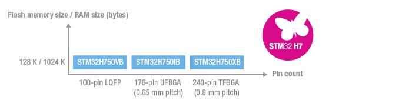

# [STM32H750](https://github.com/sochub/STM32H750)
 
#### 厂商：[ST](https://github.com/sochub/ST)
#### 父级：[STM32](https://github.com/sochub/STM32)
#### 归属：[cortex M7](https://github.com/sochub/CM7)

## [描述](https://github.com/sochub/STM32H750/wiki) 

[STM32H750](https://github.com/sochub/STM32H750)是[STM32H7](https://www.st.com/zh/microcontrollers-microprocessors/stm32h7-series.html)系列中的高性价比产品，参考售价2.69美金，用于对标RT1052产品，通过降低内部FLASH的配置，获得超高的性价比。

400 MHz CPU主频下从Flash 执行程序，STM32H750 超值系列能够实现 2020 CoreMark/856 DMIPS的性能，利用其 L1 缓存实现了零等待执行。DSP 指令集和双精度 FPU 扩大了其应用范围。得益于 L1 缓存（16 KB + 16 KB 的指令缓存和数据缓存），即使使用外部存储器也不会带来性能损失。

2 个专用音频 PLL、3 个全双工 I²S 接口、1 个支持时分多路复用 (TDM) 模式的新串行音频接口 (SAI) 和 1 个 DFSDM（用于 Sigma-Delta 调制器或 MEMS 麦克风的数字滤波器）。

多达 35 个通信接口（除了 4 个 UART 之外，还有 4 个运行速度达到 12.5 Mb/s 的 USART 接口、1 个低功耗 UART、6 个 100 Mb/s 的 SPI 接口，4 个带有新型可选数字滤波功能的 1 MHz I²C 接口、2 个 FD-CAN、2 个 SDIO、带片上 PHY 的 USB 2.0 全速设备/主机/OTG 控制器和 1 个 USB2.0 高速/全速设备/主机/OTG 控制器、片上全速 PHY 和 ULPI、以太网 MAC、SPDIF-IN、HDMI-CEC、摄像头接口、单线协议接口和 MDIO 从接口。

2 个 12 位 DAC、3 个达到 16 位最大分辨率 (3.6 Msample/s) 的快速 ADC 以及 22 个 16 位和 32 位定时器（16 位高分辨率定时器的运行频率高达 400 MHz）。利用带有 32 位并行接口的灵活存储控制器可轻松扩展存储器容量，支持 Compact Flash、SRAM、PSRAM、NOR、NAND 和 SDRAM 存储器，或利用双模 Quad-SPI 从外部串行 Flash 执行代码。

STM32H750 超值系列提供 128 KB Flash 和采用分散架构的 1 MB SRAM：用于在最低功耗模式下保存数据的 192 KB TCM RAM（包括 64 KB 的 ITCM RAM 和 128 KB 的 DTCM RAM，用于时间关键型程序和数据）、512 KB、288 KB 和 64 KB 的用户 SRAM 以及 4 KB 的备份域 SRAM，此系列采用BGA 和 LQFP 规范的 LQFP100、UFBGA176 和 TFBGA240引脚封装。

 

### [资源收录](https://github.com/sochub/STM32H750)

- [文档](docs/)
- [资源](src/)
- [freeRTOS工程](freeRTOS/)

### [替代方案](https://github.com/sochub/STM32H750)

- [RT1052](https://github.com/sochub/RT1052)
- [STM32H743](https://github.com/sochub/STM32H743)  

##  [SoC开发平台](http://www.qitas.cn)  

