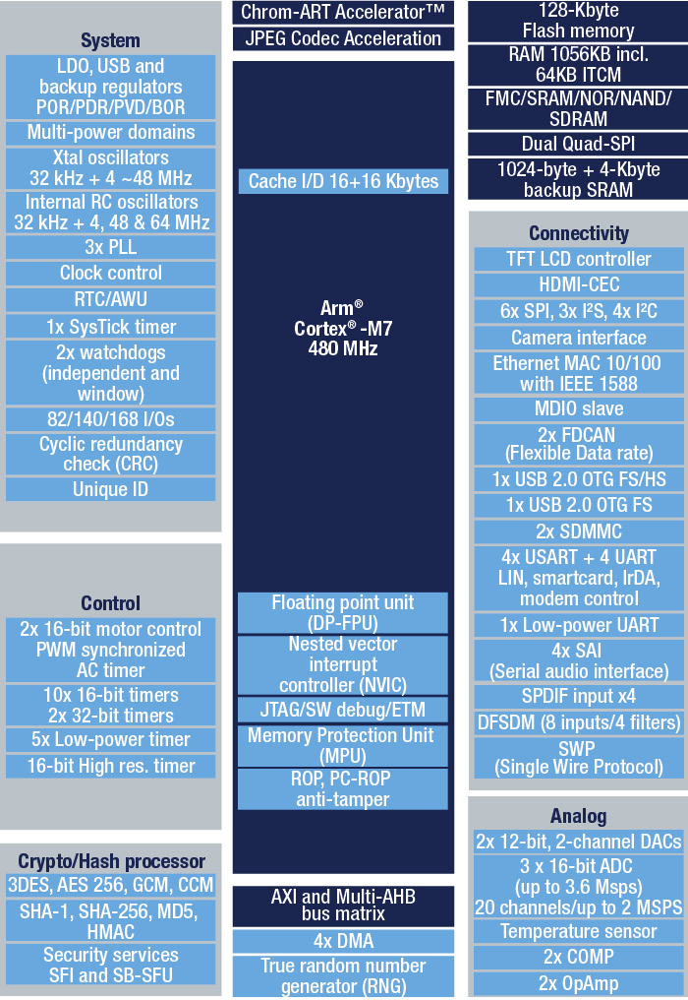

# [STM32H750](https://github.com/SoCXin/STM32H750)

* [ST](https://www.st.com/zh/) ：[Cortex-M7](https://github.com/SoCXin/Cortex)
* [L6R5](https://github.com/SoCXin/Level) ：480 MHz (2424CoreMark,1027DMIPS)

## [简介](https://github.com/SoCXin/STM32H750/wiki)

### 关键特性

* Cortex-M7 480 MHz
* Ethernet
* USB OTG HS
* 35个通信接口
* 16bit ADC(3.6 MSPS),12bit DAC
* 128 KB Flash + 1 MB SRAM

### [资源收录](https://github.com/SoCXin)

* [参考资源](src/)
* [参考文档](docs/)
* [参考工程](project/)
* [入门教程](https://docs.soc.xin/STM32H750)

### [选型建议](https://github.com/SoCXin)

[STM32H750](https://github.com/SoCXin/STM32H750)作为超值型号最先退出的产品，如果能满足你的需求，也可以再看看[STM32H730](https://github.com/SoCXin/STM32H730)

#### 封装规格

IO数量82-172，官方价: $3.69-4.77

* TFBGA240 (14×14mm)
* UFBGA176 (10×10mm)
* LQFP176 (24×24mm)
* LQFP144 (20×20mm)
* LQFP100 (14×14mm)

### [探索芯世界 www.SoC.xin](http://www.SoC.Xin)
